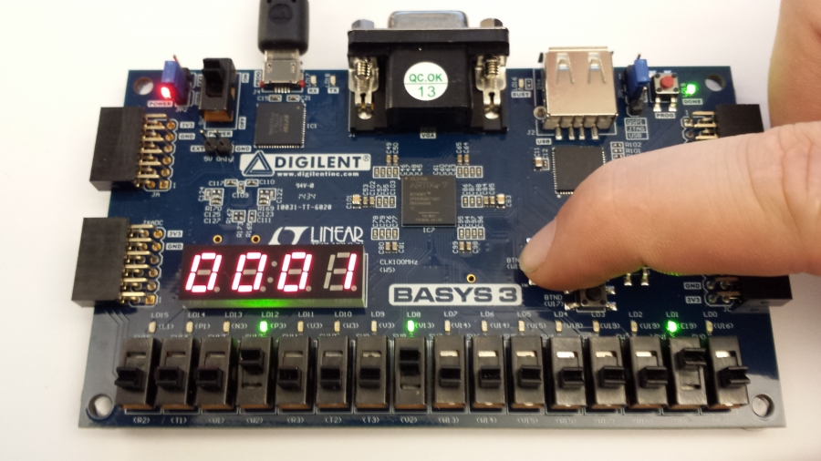

# NOTICE:
 ### For each project, you must added the constraints file to the project according to the board that you are using.

## BASYS3:

For BASYS3 Board, &nbsp;***Xlilinx Design Constraints file (XDC)*** &nbsp; to map the HDL signals to the Artix-7 pins can be found  [here](https://github.com/Digilent/Basys3/tree/master/Resources/XDC) or you can download it from this repository (just look up ;) )

You can comment or uncomment the lines according to your requirements.

In  **prj_001_sw_led** just the requred assignments are used and accordingly the constraints file that is used, does not contain all the constraints same as the constraints file called **Basys3_Master.xdc**, although you can use it.